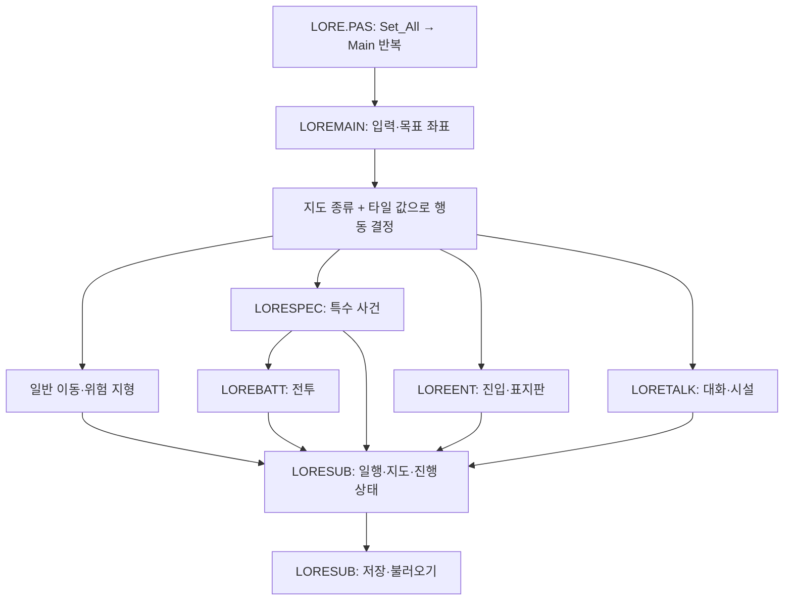

# 원본 LORE의 게임 구조

## 확인한 실행 경로

`LORE.PAS`는 `Set_All`로 일행·지도·몬스터 자료를 읽고 `Main`을 반복한다.
`LOREMAIN.PAS`의 `Main`은 입력으로 목표 좌표를 만든 뒤 지도 종류(`position`)와
해당 칸의 타일 값을 조합해 행동을 선택한다. 좌표별 사건은 그 **다음 단계**다.
원본 `readme.txt`도 `LOREMAIN`을 메인 루프, `LOREBATT`를 전투,
`LORESPEC`을 특별 이벤트, `LORETALK`를 대화, `LORESUB`를 기본 구조체와
공통 함수로 구분한다.

원본의 기본 상태는 `LORESUB.PAS`의 `party`(지도·좌표·식량·금화·`etc[1..100]`),
`player[1..7]`, `map[1..100,1..100]`, `enemydata[1..75]`, 현재 `enemy[1..7]`
등이다. `Load`는 지도 파일과 저장 상태를 읽고 지도 종류를 결정하며,
`Save`는 일행·인물·변경된 지도를 기록한다. `FOEDATA.DAT`는 몬스터 원형 자료다.

## 실제 행동 분류 규칙

원본 `LOREMAIN.PAS`의 네 `case map[x,y] of`를 요약했다. `입장`과 `대화`는
목표 타일을 밟기 전에 호출되며, `특수`는 목표 칸에서 호출된다. 위험 지형은
각각 공통 처리 루틴으로 간다.

| 지도 종류 | 특수 | 벽 | 입장 | 표지판 | 물 | 늪 | 용암 | 일반 이동 | 나머지 |
| --- | --- | --- | --- | --- | --- | --- | --- | --- | --- |
| town | 0 | 1–21 | 22 | 23 | 24 | 25 | 26 | 27–47 | 대화 |
| ground | 0 | 1–21 | 기타 | 22 | 48 | 23, 49 | 50 | 24–47 | — |
| den | 0, 52 | 1–40, 51 | 54 | 53 | 48 | 49 | 50 | 41–47 | 대화 |
| keep | 0, 52 | 1–39, 51 | 54 | 53 | 48 | 49 | 50 | 40–47 | 대화 |

ground 행의 `기타`는 앞서 열거한 타일을 제외한 값을 뜻한다. 원본은
`party.map` 번호로 지도 종류를 정하므로 같은 파일 `K_DEN2.MAP`도 맵 25는
den, 맵 26은 town으로 해석된다.

## 구조가 재사용하는 것과 직접 작성한 것

- **재사용:** 타일 행동 분류, 걷기·지형 피해·무작위 조우, 전투 턴과 결과,
  주문·시설, 일행·몬스터 자료, `etc` 상태 비트, 저장 형식.
- **지도별 직접 코드:** `LORESPEC`의 특수 사건, `LOREENT`의 지도 연결·표지판,
  `LORETALK`의 대화·시설 위치. 이 세 유닛은 지도 번호별 `case` 안에 실제
  `if` 조건을 다수 적는다. 따라서 원본 전체가 선언형 사건 데이터였던 것은 아니다.
- **자료:** `.MAP`은 타일 코드와 지형, `FOEDATA.DAT`는 몬스터 원형을 제공한다.
  지도별 사건의 조건·효과는 대부분 Pascal 코드에 남아 있다.

## 현재 이식본과 구조상 차이

| 원본 책임 | 이식본의 현재 위치 | 구조상 검토 지점 |
| --- | --- | --- |
| 타일 행동 분류·이동 | `LoreMapData.getCategory`, `LoreMovementLogic`, `LoreGame.tryMove` | 원본의 호출 순서와 타일별 우선순위를 한 계약으로 고정 |
| 특수 사건 | `LoreSpecialEventDispatcher`가 직접 프로시저 또는 미이전 처리기를 선택 | 직접 소유 경로는 JSON 가용성과 무관하게 실행; 미이전 경로만 이전 처리기 유지 |
| 진입·표지판 | `LoreWorldManager`의 JSON/내장 규칙, `LoreGame`의 진입 처리 | 규칙 없는 진입 타일은 이동하지 않도록 고정; 진입 직전 효과·지도 로드 순서를 계속 검토 |
| 대화·시설 | `LoreScriptEngine`, `LoreDialogueManager`, 시설 규칙 | 같은 좌표의 우선순위와 상태 변경을 단일 대화 경계에서 관리 |
| 전투·상태 | `BattleEngine`, `ScriptBattleSession`, 여러 reducer와 화면 상태 | 선택·난수·승리·도주·패배의 순서 있는 효과를 한 상태에 반영 |

현재 이식본에도 원본 구조의 주요 구성요소가 있다. 반복해서 차이가 나온 이유는
구성요소가 없어서만이 아니라, 같은 행동을 여러 경로가 처리하고 화면 콜백과
엔진 상태 변경의 순서가 분산되어 있기 때문이다. 이 진단은 구조상 위험을
가리키며, 위 경로의 실제 동작이 모두 틀렸다는 판정은 아니다.

## 이후의 작업 단위

실제 구현 순서와 완료 판정은 `PORT_DIRECT_PORT_STRATEGY.md`를 따른다.
아래 구조 분류는 원본 프로시저를 직접 옮길 때 재사용 경계를 찾는 자료다.

1. `입력 → 목표 타일 판정 → 사건/이동 → 전투·선택 → 순서 있는 효과 → 저장`
   계약을 원본 기준으로 고정한다. 첫 단위로 `LoreTileProtocol`이 네 지도 종류의
   타일 값 0–255를 분류하고 `LoreMapData`·`LoreMovementLogic`이 이를 사용한다.
   `source_tile_protocol_test.dart`는 원본 범위 명세와 1,024개 조합을 비교한다.
   특수 타일에 포털 규칙이 겹칠 때의 기존 처리 경로는 별도 표식으로 남긴다.
   다음에는 사건·전투까지의 호출 순서를 한 실행 경계에서 비교한다.
2. 상태 변경을 단일 게임 상태와 효과 적용기에 모으고, 화면은 결과를 표시한다.
   특수 사건은 `LoreSpecialEventDispatcher`에서 직접 프로시저 소유 경로와
   미이전 처리 경로를 구분한다. 포털은 등록된 목적지가 있을 때만 요청하도록 고정했다. 이어서
   진입 효과·대화·상태 효과도 같은 원칙으로 정리한다.
3. 원본 프로시저의 지도별 `case`·조건·반복·계산을 Dart로 보존한다.
   반복 패턴의 추상화는 원본 대조 이후 필요할 때만 수행한다. 맵 표현과
   대사 자료는 재사용하되 원본 타일 코드와 `etc` 바이트 의미는 유지한다.
4. 분기 목록은 독립 구현 작업 목록이 아니라, 위 계약에 연결되지 않은 원본
   조건을 찾는 최종 누락 검사에 쓴다.

원본 근거: `readme.txt`의 파일 설명, `LORE.PAS`의 초기화·메인 루프,
`LOREMAIN.PAS:144–294`의
입력·타일 분류, `LORESUB.PAS:10–113`의 상태 구조와 `1636–1790`의
불러오기·저장, `LOREBATT.PAS:972–1282`의 전투 결과·무작위 조우,
`LORESPEC.PAS`, `LOREENT.PAS`, `LORETALK.PAS`의 지도별 `case`.
