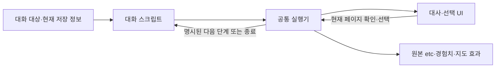

# 대화 스크립트와 모바일 진행

LORETALK.PAS의 마을 대화 내용을 타입이 있는 Dart 스크립트로 옮겼다.
원본 대사·색·동적 이름·조건·난수 호출·선택 결과·보상·지도 변경은 유지한다.
모바일에서 다시 말을 걸어야 이어졌던 설명을 같은 창에서 연결하는 부분만
대화 진행 규칙으로 명시한다. 원본 replay는 같은 정의를 한 CASE씩 실행한다.

## 파일과 책임

| 파일 | 책임 |
| --- | --- |
| `lib/data/lore_dialogue_scripts.dart` | map 6·7·9·10·24·27의 전체 talkmode 대사·분기와 네 성주의 단계/연결 정의 |
| `lib/logic/lore_dialogue_flow.dart` | 타입별 실행, 확인 대기, 선택, 효과 순서, 다음 단계, 정의 검증 |
| `lib/logic/lore_dialogue_io.dart` | 원본 상태창/대사/선택 어댑터 계약 |
| `lib/logic/lore_talk_mode.dart`, `lore_water_lord.dart` | 호출 호환성을 유지하는 공통 스크립트 진입점 |
| `lib/widgets/mobile_dialogue_session.dart` | 대화 창 유지·내용 교체·입력 중복 방지·화면 폐기 처리 |

JSON을 실행 규칙으로 해석하거나 화면에서 특정 NPC의 다음 대사를 판단하지
않는다. 동적 조건과 이름은 실행 시점의 `DialogueContext`를 읽는 Dart 식이다.
실행기에는 개별 NPC 좌표·퀘스트값을 넣지 않는다.

기존 `ScriptRun`은 사건 결과를 묶어 UI에서 적용하는 부분이 있다. 대화의
확인 전/후 경험치와 raw byte 변경 순서를 보존하기 위해 대화 노드는 효과를
해당 위치에서 즉시 실행한다. 모집처럼 이미 원본 순서가 검증된 사건은 기존
실행기를 호출해 재사용한다.

## 노드

| 노드 | 의미 |
| --- | --- |
| `DialogueSequence` | 순서대로 실행. 동기 문장은 동기 실행하며 실제 대기에서만 중단 |
| `DialogueLine`, `DialogueHighlight` | 원본 Print/cPrint의 대사와 색, 동적 이름 |
| `DialoguePage` | 현재 페이지 확인 후에만 이후 노드를 실행 |
| `DialogueWhen`, `DialogueCases` | 현재 raw 상태로 조건/CASE 선택. 미래 분기를 미리 평가하지 않음 |
| `DialogueQuest` | raw etc byte별 단계와 명시적인 모바일 `next` 연결 |
| `DialogueChoice`, `DialogueChallenge` | 선택 결과에 따른 분기와 원본 Y/n 키 처리 |
| `DialogueWriteByte`, `DialogueExperience` | 원본 byte 대입 및 signed longint 경험치. 빈 슬롯 제외, 첫 6슬롯 규칙 유지 |
| `DialogueTile`, `DialogueTiles`, `DialogueBlink` | 지도 쓰기 순서와 유골 연출 |
| `DialogueRecruit` | 기존 Dart 모집 스크립트의 선택/슬롯/지도 효과를 재사용 |
| `DialogueClear`, `DialogueLog`, `DialogueRefresh` | 원본 창·메시지·상태 갱신 |
| `DialogueEnd` | 대화 종료. 바깥 순서의 후속 효과도 실행하지 않음 |

예를 들어 대사 → 경험치 → 확인 → etc 증가라는 원본 순서는 그대로 네 노드로
정의한다. 확인 전에 경험치를 지급하는 성주와 확인 후 지급하는 성주를 하나의
일괄 결과로 합치지 않는다. 화면이 폐기되면 대기 뒤의 후속 변경은 중단한다.
확인 전 이미 원본이 지급한 보상을 되돌리거나 다시 지급하지 않는다.

## 모바일 연결과 임무 경계

| 대화 정의 | raw byte | 연결 |
| --- | --- | --- |
| LORE 성주 | etc[10] | 0 인사 → 1 세계 배경 → 2 MENACE 임무. 4 보상 → 5 LASTDITCH 안내 |
| LASTDITCH 성주 | etc[13] | 2 보상 → 3 GROUND GATE 안내 |
| GAIA TERRA 성주 | etc[14] | 2 봉인 보상 → 3 QUAKE 임무. 5 보상 → 6 WATER FIELD 안내 |
| WATER FIELD 성주 | etc[15] | 0 소개 → 1 NOTICE 임무. 2 보상 → 3 LOCKUP 임무. 4 보상 → 5 Swamp Key 안내 |

`next`가 없는 단계는 종료한다. 임무 알림에서 완료/보상 단계로 자동 이동하지
않는다. 다음 단계는 앞선 원본 효과가 raw byte를 그 값으로 변경했을 때만
실행된다. 따라서 LORE의 첫 대화 후 etc[10]은 3이며, MENACE 탐사가 원본
조건을 충족해야 4의 보상 대화를 볼 수 있다.

중간 단계에서 저장을 불러오면 저장된 raw byte부터 시작한다. 대화 커서·새
퀘스트 필드·완료 플래그를 저장 형식에 추가하지 않는다. 한 페이지 안의 선택과
다중 페이지 NPC 대사도 같은 순서 노드로 실행한다. 잘못된 단계 참조·순환·선택
번호는 첫 대사나 보상이 실행되기 전에 정의 검사에서 거부한다.

## 검증과 범위

이관 전에 commit `e96fc63195aaf0c75c5b08c0b0620e9135ad3fc1`의 원본 Dart
실행으로 2,525개 표본을 캡처했다. 148개 원본 좌표, 조건/선택/성별/난수/중단
변형, 네 성주의 0..255 raw 단계와 지역 조건을 포함한다. 추적은 대사·색·키
확인 당시 etc/경험치·지도 쓰기·연출·모집·난수 순서 및 최종 상태를 비교한다.
기록은 `test/fixtures/source_dialogue_migration_baseline.json.gz`에 보관한다.
이는 이관 회귀 기준이며, 독립 DOS 숫자 증거를 대신하지 않는다. 기존 DOS
보상 fixture·source talk/선택/유골 연출 검사를 계속 실행한다.

추가 검사는 모바일 연결의 종료점, 경험치 1회 지급, 확인 대기에서의 폐기,
조건의 지연 평가, 깨진 정의 거부와 실제 모바일 UI의 동일 route 유지다.
상점/훈련/병원은 기존 시설 디스패처, 모집은 기존 Dart 모집 스크립트를 쓴다.
LORESPEC/LOREENT의 입구·전투·지도 사건은 기존 공통 ScriptRun 실행기를
유지하며 이번 마을 대화 이관에 포함하지 않는다.
